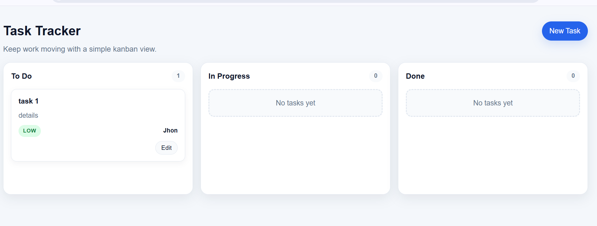
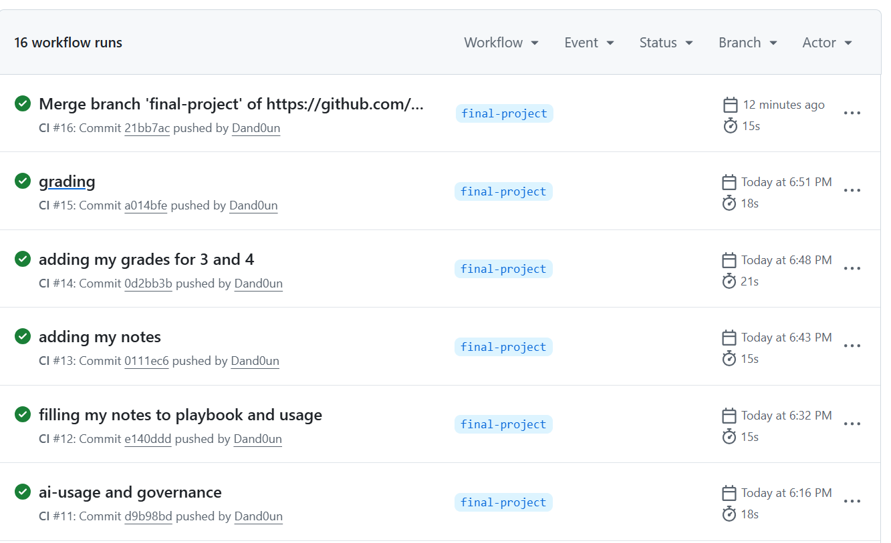

# Release Evidence

## Baseline

- Branch: `final-project`
- Date: 2026-08-01
- Local app run command: `py -m uvicorn app.main:app --reload`
- `/health` result: verified in-process with FastAPI `TestClient` on 2026-08-01: HTTP 200 and `{"status":"ok","timestamp":"2026-08-01T15:59:32.797175+00:00"}`. The full Uvicorn server command was not started during this check.
- Frontend check: manually verified in a browser during this release check.

 The Kanban UI and create/edit controls are present in `app/frontend/index.html`; 
- Test command: `py -m pytest -v`
- Test result: 17 passed in 0.32 seconds. Two non-failing warnings were emitted: a Starlette deprecation warning for HTTP 422 and a pytest-cache permission warning.

## CI evidence

- Workflow file: `.github/workflows/ci.yml`
- Green run screenshot:

- CI run note: the workflow is configured to run on push and pull request, and the repository’s local verification showed that the same test command (`python -m pytest -v`) completed successfully in this environment.
- Test command used by CI: `python -m pytest -v`
- Dependency installation: CI upgrades pip and installs `requirements.txt` before the test command.
- Shortcut check: reviewed `.github/workflows/ci.yml`; no `continue-on-error`, `|| true`, or skipped pytest command was found. Python is explicitly pinned to 3.11.

## Docker evidence

- Build command: `docker build --tag task-tracker-api:final .`
- Run command: `docker run --detach --rm --name task-tracker-api-final --publish 8000:8000 task-tracker-api:final`
- `/health` check: completed successfully on 2026-08-01. The image built, a temporary container ran on host port 8000, and `http://127.0.0.1:8000/health` returned HTTP 200 with `{"status":"ok","timestamp":"2026-08-01T16:14:39.835752+00:00"}`. The temporary container was stopped after the check.
- Non-root check: verified by inspection. The Dockerfile creates user `app` and uses `USER app` before its runtime command.
- No-baked-secrets check: verified by inspection. The Dockerfile copies only `requirements.txt`, the built virtual environment, and `app/`; `.dockerignore` excludes `.env` and `.env.*`.

## Documentation claim-vs-reality log

| Claim checked | Evidence used | Result | Change made, if any |
|---|---|---|---|
| `uvicorn app.main:app --reload` is the local API run command. | `README.md` and `app/main.py` | Confirmed: `app.main:app` exposes the FastAPI application. | None in this evidence check. |
| `GET /health` returns the documented health response. | `app/main.py`, `app/schemas/health.py`, and FastAPI `TestClient` request | Confirmed: HTTP 200 with `status: "ok"` and a UTC timestamp. | None in this evidence check. |
| `.env` can be created from `.env.example`. | `README.md` and `.env.example` | Confirmed: `.env.example` exists and declares `PORT` and `APP_ENV`. | None in this evidence check. |

